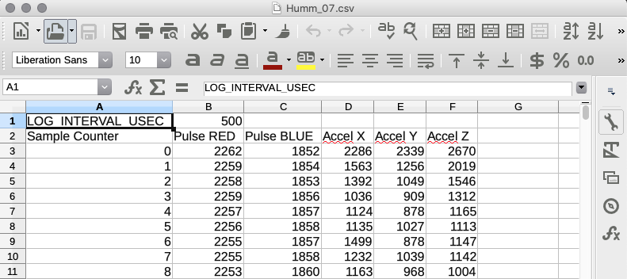

# Humming Bird Pulse Sensor

Hi.
This project is also on [Hackaday.io](https://hackaday.io/project/184261-hummingbird-heartbeats)

Adding files as they become publishable (read: workish)

## Basic Shape
What you have here is a Teensy 3.6 that reads 5 analog inputs at a very high rate and stores the data to SD card. 

-	Sensors
	- Pulse Sensor 2x
	- Analog Accelerometer

The signal of interest is likely in the hundreds of hertz. Here's a ball park:

	Hummingbird Heart Rate 800 Beats Per Minute (BPM)
	BPM = 60 Seconds / Inter-beat Interval (IBI)

the IBI value is the time between beats. the IBI associated with a heart rate of 800 BPM is 75 milliseconds (0.075 Seconds). That 800 BPM number I just pulled out of the air. It could be faster, based on the liturature. So we need a high sample rate. 

I'm starting with a Teensy 3.6 and the [ExFatLogger.ino](https://github.com/greiman/SdFat/tree/master/examples/ExFatLogger) example to get high speed SD card writing. The basic Arduino code is [there](https://github.com/biomurph/DINACON_Hummingbird_Heartbeats/tree/2022/2022/Arduino/humm_beat_sensor_01).

## Hardware
The device simply will not work if SD card is not installed! Unplug device, install SD card, plug in device.

### Pulse Sensors
The Pulse Sensors are 'sealed' with nail polish on the back. If you need to re-apply any sealant, you must use care so that the paint or sealant you use does not creep or wick around the LED in the middle of the board! Super important.
The RED Pulse Sensor is the first data column, the BLUE Pulse Sensor is the second data column.
On the front, they have a clear vinyl sticker. There are replacement stickers in the kit if you need to replace one.
### Accelerometer
The Accelerometer is also 'conformally coated' on the circuit side with nail polish. The accelerometer X, Y, and Z axis are the 3rd, 4th, and 5th data columns. See below for sample data. It's the [ADXL-335](https://www.adafruit.com/product/163).

This is the force axis orientation.

### Push Button
The push button can be used to initiate a recording session. All it does is initiate. Recordings are timed. See below.
### Coin Battery
There is a coin battery holder that you can use to add a coin battery. The coin battery, when installed, will help the 
## User Guide

The interface allows you to create, access, and manipulate binary files. Sensor data is recorded to the SD card in a binary format to facilitate high speed logging.

Hardware is powered via USB, and requires a connected Terminal or Data Visualizer to begin operation.  When you plug in the USB *without Terminal or Data Visualizer* the BLUE LED will be steady on. Once the port is connected, the BLUE LED will pulse/fade nicely saying it is ready. Set your serial port to 250000 baud. These are the keyboard commands that you can use to control the device:

	type: 
	b - open existing bin file
	c - convert bin file to csv file (DON'T TRY TO CONVERT A CSV FILE!)
	l - list files
	p - print opened bin file data to Serial (DON'T TRY TO PRINT A CSV FILE!)
	r - record data
	t - test without logging
	? - print this message
	type a number to set record duration
		 1 - 5 seconds
		 2 - 10 seconds
		 3 - 15 seconds
		 4 - 20 seconds

It is recommended to follow a specific series of steps to use the interface efficiently. Though it is not possible to screw it up really bad, it can be confusing without this guide. Here are the steps for success:
### RECORDING DATA

1. Insert a micro SD card that is formatted as ExFat (super important)
2. Open Arduino IDE
3. Plug into USB computer
4. Select the port from the Tools > Port drop down menu
5. Open up the Arduino Serial Plotter (Command + Shift + L)
6. Make sure your baud rate is set to 250000
7. In the 'data to send' window, you can use the command set to control the device.
8. Start by sending `t` to begin streaming data to the terminal for viewing and verification
9. When you want to do any recording, send `r` or press the red button to record. The data stream will halt while recording
10. When record time is up, you need to send `t` again to bring back the data stream
11. Repeat steps to visualize and record as you like.

**NOTE: There are messages that are sent before and after the data stream, so you might see 'glitching' at these transient times**

***needs a pic of the Arduino Plotter with notes***

### RETREIVING DATA

1. Close the Serial Plotter, if it is open
2. Open the Serial Monitor (Command + Shift + M)
3. Send `l` to list the files that are on the disk
4. Send `b` to request to open a binary file
5. Type in the name of the binary file exactly: `Humm_01.bin` for example
6. Once the file is open, send `c` to convert it into a `.csv` file
7. The new `.csv` file will now be listed when you send `l`
8. Rinse, repeat

This code is super duper simple. There's no command to close a file, for example. Just trust that when you open a new file or start recording you will be closing the old one. When you've converted all of the files that you want to, unplug the device and remove the SD card. I recommend using the spudger included to make SD card removal easy. If you have long nails, that works too.  Use the included SD card reader dongle to retrieve the desired CSV files.
After copying the data you want off the micro SD, you can clear the disk by moving all the files into your trash.

**Make sure to empty your trash on the computer before un-mounting the disk to properly delete files from the disk**

# Data
Data is initially stored in .bin files. You need to manually convert them to .csv files for further processing.
There are two file types and 4 file size options. The Serial Monitor will give you data on all of this when you list files or record with the monitor open. here are examples of file sizes in bytes for different record times

Record Duration | BIN file size | CSV file size
:--------------:|:-------------:|:------------:
5 Seconds  |  100,502  |   280,524   |
10 Seconds |  200,502  |   564,669   |
15 Seconds |  300,502  |   847,828   |
20 Seconds |  400,502  |   1,125,782   |

The CSV data file will look like this

The first column is a simple sample counter. It is only a byte, and it will roll over to `0` after it hits `255`. I've limited it's maximum size to make the Serial Plotter more manageable. The data is raw, and it's generated by a 12 bit ADC, so the range is from `0` to `4095`. All of the sensors will idle at approx 1/2 of the analog range. for the accelerometer values, the ADC value is directly linearly scalable to gs. `0` counts is -3.0g and `4095` counts is +3.0g
	
## Serial Plotter
Arduino Serial Plotter is pretty simple, and it auto ranges. The maximum range of the data of interest is 4095. If you see a spike that is much higher than that (auto ranging), you will need to wait for the spike to travel across the screen.

You'll likely want to switch between Serial Monitor and Serial Plotter, so use the key commands. The Serial Monitor has a text field at the top to send commands, and the Plotter has a text field on the bottom.

`COMMAND + w` to close an open window

`COMMAND + SHIFT + L` open plotter window

`COMMAND + SHIFT + M` open monitor window

I'm holding my fingers on the two Pulse Sensors, and the accelerometer is laying flat on my desk in the image below. The Z axis is registering 1g due to gravity, and the dark and light blue lines in the center are the other axis registering 0g-ish. If the Accelerometer is held flat against the bird, then the Z axis could register expansion due to respiration`?`

